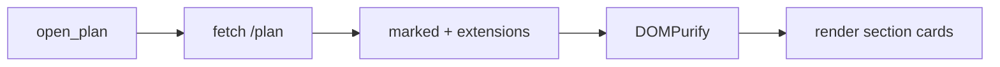

# Visual Block Showcase

A sample plan that exercises every visual feature of the dark-phosphor theme:
the four custom blocks (`compare`, `steps`, `callout`, `decision`), a `mermaid`
diagram, a plain markdown table, code, and a blockquote. Select any prose and
the comment toolbar still works — only the visual blocks are non-annotatable,
exactly like the mermaid diagram.

## Compare

The `compare` block puts options side by side. Red edge = before / worse,
phosphor edge = after / better, plain edge = neutral.

```compare
[bad] Current
Sync `N+1` query — one DB round-trip **per investor row** on every render.
[good] Proposed
A single annotated query using an `F()` expression. One round-trip total.
```

Three-way comparisons collapse responsively as the margin narrows:

```compare
[bad] Raw HTML in markdown
Verbose, error-prone, DOMPurify can strip classes.
[neutral] Generic directive parser
Flexible but over-engineered for four fixed blocks.
[good] Per-block marked extension
Mirrors the proven mermaid pattern. Chosen.
```

## Steps

The `steps` block renders an auto-numbered sequence. A ` | ` splits an optional
muted detail off the lead.

```steps
1. Write failing unit tests | tests/js/blocks.test.mjs
2. Implement the pure renderers | static/js/blocks.js
3. Wire the marked extensions | static/js/render.js
4. Retheme the page | static/js/../styles.css
5. Verify in the browser
```

Markers are optional — bare lines auto-number too:

```steps
Discover the change sites
Transform each one
Verify nothing regressed
```

## Callouts

Six callout types, each a quiet tinted left-border.

```callout note
Comment anchors use `textContent` offsets, so visual-only blocks aren't
text-selectable for inline comments — same as mermaid today.
```

```callout tip
All four blocks are static HTML — no client-side hydration step, unlike mermaid.
```

```callout warn
The block fences must use the exact tag (`compare`, `steps`, `callout`,
`decision`); an unknown callout type silently falls back to `note`.
```

```callout danger
Never relax DOMPurify to pass arbitrary HTML — keep block output known-safe.
```

## Decision

The `decision` block is a ✓/✗ matrix. Unrecognized cells render as muted text.

```decision
Question | Marked ext | Raw HTML | Directive
Needs new parser code? | yes | no | yes
Keeps the .md readable? | yes | no | maybe
Survives DOMPurify cleanly? | yes | risky | yes
Matches existing mermaid pattern? | yes | no | no
```

## Mermaid (still works, now dark)



## Plain markdown still renders

A normal table:

| Component | File | Hydration |
| --- | --- | --- |
| compare | blocks.js | none |
| steps | blocks.js | none |
| mermaid | render.js | mermaid.run() |

Inline `code`, a fenced code block:

```python
def render_plan(markdown: str) -> str:
    return sanitize(marked.parse(markdown))
```

> A blockquote, for good measure — checking that quoted text stays legible on
> the dark surface.
